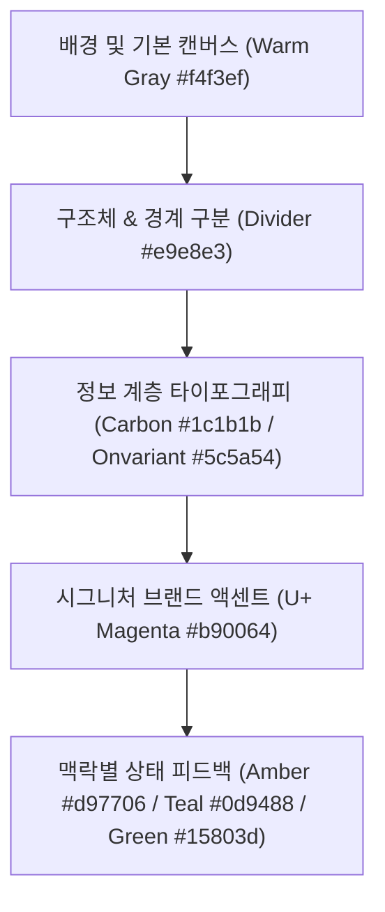

# LG U+ 성과관리시스템 디자인 시스템 가이드 (U+design.md)

본 문서는 성과관리시스템 운영 매뉴얼(`code_artifact-2.html` 및 `refer.html`)의 일관성 있는 시각 정체성을 향후 개발될 **추가 웹 문서, 보고서 문서(Markdown/Word), 그리고 프레젠테이션 슬라이드(PowerPoint, Keynote)** 등 다른 매체에 그대로 복제할 수 있도록 정의한 실무 관점의 **통합 디자인 표준 가이드라인**입니다.

이 가이드를 준수하면 개발자, 디자이너, 실무 기획자 등 담당자가 바뀌더라도 동일한 무드와 고품질의 산출물을 일관성 있게 생산할 수 있습니다.

---

## 1. 디자인 정체성 및 무드 (Design Identity & Mood)

본 시스템의 디자인 테마는 **"따뜻한 신뢰감 (Warm Professionalism)"**을 지향합니다. 기존 IT 시스템이 주로 사용하는 차갑고 날카로운 블루/다크 그레이 톤을 배제하고, 인체에 편안함을 주는 **웜 그레이(Warm Gray)**를 기본 배경으로 설계하여 장시간 작업하는 실무자의 피로도를 최소화합니다. 여기에 **LG U+ Magenta** 컬러를 정밀한 타격형 액센트로 조화롭게 융합시켰습니다.

---

## 2. 컬러 팔레트 계층 및 적용 우선순위 (Color Palette & Hierarchy)

모든 시각 요소(텍스트, 배경, 테두리, 배지, 다이어그램)는 사전에 정의된 컬러 계층에 따라 **명확한 우선순위**를 갖고 적용되어야 합니다. 임의의 원색(완전한 빨간색, 파란색 등)을 사용해서는 안 됩니다.



### [우선순위 1] 배경 및 기본 캔버스 (Base & Surface)
가장 넓은 면적을 차지하는 요소로, 눈의 편안함과 깔끔한 구조를 만듭니다.
*   **전체 캔버스 배경**: `HEX #f4f3ef` (웜 그레이). PPT 슬라이드 마스터 배경으로도 기본 적용합니다.
*   **개별 카드/콘텐츠 박스**: `HEX #ffffff` (순수 흰색). 배경 위에 떠 있는 느낌의 선명한 표면을 형성합니다.
*   **섹션/컨테이너 배경**: `HEX #fafaf9` (극도로 연한 웜 화이트). 카드 안의 특정 그룹 영역을 나눌 때 사용합니다.

### [우선순위 2] 정보 계층 타이포그래피 (Typography)
*   **기본 텍스트 및 핵심 제목**: `HEX #1c1b1b` (Carbon Black). 순수 검정(#000000) 대신 부드러운 차콜 블랙을 써서 가독성을 높입니다.
*   **보조 텍스트 및 설명문**: `HEX #5c5a54` (Onvariant Gray). 웜 톤의 다크 그레이로 주석이나 보조 정보에 사용합니다.
*   **안내선 및 비활성 상태**: `HEX #8a8880` (Outline Gray). 연한 플레이스홀더나 얇은 가이드에 적용합니다.

### [우선순위 3] 구조체 및 경계 구분 (Borders & Dividers)
구역을 부드럽게 격리하는 얇은 경계선용 컬러입니다.
*   **기본 테두리 및 디바이더**: `HEX #e9e8e3` (Surface Container). 모든 테이블 선, 카드 테두리는 이 색상을 기본으로 하며 `1px` 두께를 권장합니다.
*   **강조 경계선/배지 테두리**: `HEX #d4d3cc` (Surface highest). 

### [우선순위 4] 시그니처 브랜드 액센트 (Brand Accent)
주의를 환기시키고 브랜드의 아이덴티티를 심어주는 용도로, 전체 화면 면적의 **3% 미만**으로 사용을 엄격히 통제합니다.
*   **브랜드 마젠타**: `HEX #b90064` (U+ Magenta). 타임라인 주요 단계, 핵심 아이콘, 수기 관리 대상 테이블 등 반드시 강조해야 하는 고정 요소에 사용합니다.
*   **소프트 마젠타 틴트**: `HEX #b90064` 에 투명도 `3%` ~ `5%`를 적용한 배경색. 주로 마젠타 텍스트가 올라가는 배지의 연한 배경이나 강조 영역에 은은하게 조합합니다.

### [우선순위 5] 맥락별 피드백 (Contextual Feedback)
특정한 예외나 마감 프로세스상의 의미를 전달할 때 제한적으로 적용합니다.
*   **종료/주의 경보 (Amber)**: `HEX #d97706` (Amber/Orange). 2026년 계약 종료 예정건, 주의가 필요한 한계 조항 등에 매핑합니다.
*   **일회성/특수 처리 (Teal)**: `HEX #0d9488` (Teal). 일회성 심의, 특별 조정 프로세스 등에 매핑합니다.
*   **표준 PL 기준 준수 (Green)**: `HEX #15803d` (Green). 부문 PL 이익률 마감, 마트 최종 안착 등 표준 프로세스에 안착한 정보에 매핑합니다.

---

## 3. 타이포그래피 규칙 (Typography Rules)

다른 문서나 슬라이드 제작 시 동일한 무게감을 주기 위한 글꼴 사용 기준입니다.

| 위계 (Hierarchy) | 권장 크기 (Web) | 권장 크기 (PPT) | 글꼴 굵기 (Weight) | 글꼴 색상 (Color) | 적용 대상 |
| :--- | :--- | :--- | :--- | :--- | :--- |
| **대제목 (Title)** | `22px` (1.375rem) | `32pt` | Bold (700) | `Carbon (#1c1b1b)` | 웹 상단 헤더, 표지 타이틀 |
| **섹션 제목 (H2)** | `18px` (1.125rem) | `20pt` | Bold (700) | `Carbon (#1c1b1b)` | 대메뉴, 챕터 타이틀 |
| **소제목 (H3/Card)**| `16px` (1.0rem) | `16pt` | Bold (600/700) | `Carbon (#1c1b1b)` | 카드 내부 소 타이틀, 배지 내용 |
| **본문 (Body)** | `14px` (0.875rem) | `13pt` | Regular (400) | `Carbon (#1c1b1b)` | 기본 설명 단락 |
| **보조 설명 (Caption)**| `12px` (0.75rem) | `11pt` | Medium (500) | `Onvariant (#5c5a54)`| 푸터 주석, 팁 박스 내용 |
| **초소형 정보 (Micro)** | `11px` (0.6875rem) | `9.5pt` | Bold (700) | `Onvariant/Primary` | 흐름도 단계 라벨, 테이블 헤더 |

---

## 4. 표(Table) 디자인 표준 가이드 (Table Design Standard)

대량의 원천 데이터와 수치 계산 명세를 표시하는 표는 정보 왜곡이 없고 시선이 자연스럽게 흘러가도록 아래 규칙에 맞춰 스타일링합니다.

### 4.1 기본 형태 및 테두리
*   **외부 경계 및 내부 격자**: 테이블 외곽을 가두는 두꺼운 선은 사용하지 않습니다. 오직 수평선(`border-b`)만 사용하며 색상은 `brand-surface-container (#e9e8e3)`를 씁니다. 수직 격자선(`border-r`)은 생략하여 시야를 가로막지 않게 합니다.
*   **여백**: 행 높이는 넉넉히 설정하여 가독성을 높입니다. (웹 기준 `py-2.5 px-2`, 슬라이드 기준 행 높이 1.2배 이상).

### 4.2 헤더와 본문 텍스트 스타일
*   **헤더행 (`thead`)**: 
    *   배경색은 본문 영역과 분리되도록 아주 연한 브라운 그레이(`HEX #f5f0e8` 또는 `#fafaf9`)를 깝니다.
    *   글씨는 짙은 보조색 `brand-onvariant (#5c5a54)`에 **크기는 본문보다 작게(11px~12px)**, 굵기는 **Bold(600/700)**로 설정하여 명확한 헤드라인 역할을 수행하게 합니다.
*   **본문행 (`tbody td`)**:
    *   정적 텍스트는 `brand-carbon (#1c1b1b)` 기본 크기(12px~14px)를 사용합니다.
    *   **정렬 원칙**: 문자열 데이터(고객명, 손익코드 등)는 **왼쪽 정렬**, 계산 근거나 상태값은 **가운데 정렬**, 매출/이익 등 수치 데이터는 반드시 **오른쪽 정렬**합니다.
    *   **수치 특화 서체 지정**: 오른쪽 정렬되는 모든 수치는 숫자 폭이 들쭉날쭉해지지 않도록 글꼴 옵션에 `font-variant-numeric: tabular-nums;` 또는 고정폭(Mono) 스타일을 믹스하여 단위 정렬을 칼같이 맞춥니다.

### 4.3 특수 강조 및 하이라이트 행
*   **총합계(Total) 행**:
    *   배경색은 일반 행과 강력하게 대조되는 짙은 차콜/소프트 블랙(`HEX #181715` 또는 `#1c1b1b`)을 사용합니다.
    *   텍스트는 흰색(`HEX #faf9f5`)으로 반전시키고 수치 값은 U+ 마젠타나 골드 옐로우 계열로 지정하여 정보의 피날레를 강조합니다.
*   **행별 상태 강조 배경색 (Row Accent)**:
    *   주의(Orange/Amber): `bg-amber-500`에 투명도 `10%` (`#fdf6ee`)
    *   정상(Green/Teal): `bg-teal-600`에 투명도 `6%` (`#edf6f4`)

---

## 5. 순서도 및 다이어그램 표준 가이드 (Flowcharts & Diagrams)

시스템 구성도나 가공 흐름을 표시할 때 임의의 모양이나 화려한 도형 효과를 지양하고 극도의 기하학적 정돈을 구현합니다.

```
[원천 데이터 계층]  ── (화살표 #6c6a64) ──>  [데이터 가공 계층]  ── (화살표) ──>  [시각화 표출 계층]
  * 노드: #efe9de                               * 노드: #ffffff                          * 노드: #ffffff
  * 테두리: #e6dfd8                             * 테두리: #b90064 (U+ 마젠타 강조)       * 테두리: #e6dfd8
```

### 5.1 프로세스 노드 (Node) 스타일
*   **일반 노드**: 배경은 순수 흰색(`#ffffff`) 혹은 은은한 샌드 그레이(`#efe9de`)를 채우며, 테두리는 아주 얇고 흐린 브라운 그레이(`#e6dfd8`)를 두릅니다. 모서리 반경은 **12px~14px (rounded-xl)**로 둥글게 깎아 부드러운 인상을 줍니다.
*   **핵심/활성 노드 (Active Node)**:
    *   배경에 U+ 마젠타의 초미세 틴트(`bg-brand-primary/[0.02]` 등)를 연하게 깔아 활성 상태임을 암시합니다.
    *   테두리를 명확한 **U+ 마젠타 (#b90064)** 브랜드 컬러로 굵게 표기합니다.
    *   웹 환경에서는 바깥쪽에 부드러운 마젠타 그림자(`box-shadow: 0 0 0 4px rgba(185, 0, 100, 0.1)`)를 적용하여 입체적으로 돌출시킵니다.

### 5.2 화살표 및 커넥터 (Arrows & Connectors)
*   **선 두께 및 색상**: 커넥터 라인은 테두리선보다 약간 어두운 미디엄 그레이(`HEX #6c6a64` 또는 `#8a8880`)를 채택하여 선명하게 연결 관계를 그립니다. 두께는 `1.5px` ~ `2px`를 유지합니다.
*   **흐름의 일관성**: 왼쪽에서 오른쪽(`L -> R`), 혹은 위에서 아래(`T -> B`)의 단방향 흐름만 허용하며 대각선 꺾임이나 교차는 레이아웃 단계에서 완전히 차단합니다.

---

## 6. 도형 및 UI 요소 표준 설계 (Shapes & UI Elements)

슬라이드나 추가 문서를 직접 편집하는 사용자가 복제하여 쓸 수 있는 단위 파츠별 명세입니다.

### 6.1 콘텐츠 카드 (Content Card)
*   **도형 형태**: 직사각형 모서리를 둥글게 한 형태 (반경 `12px` ~ `16px`).
*   **테두리**: `HEX #e9e8e3` (1px 두께 실선).
*   **배경**: `HEX #ffffff` (흰색).
*   **효과**: 그림자(Drop Shadow)는 되도록 사용하지 않거나, 극도로 은은한 흐림 효과(투명도 3% 미만의 Warm Black 그레이)만 허용합니다. 기본적으로 플랫(Flat)한 2D 플랫 카드 레이아웃을 지향합니다.

### 6.2 배지 및 배너 (Badges & Pills)
소형 레이블이나 단계를 표기하는 캡슐 형태의 요소입니다.
*   **도형 형태**: 완전히 둥근 캡슐형 (반경 `999px`).
*   **일반 일정 배지**: `text-brand-carbon (#1c1b1b)` 글씨 + `bg-brand-surface-highest (#d4d3cc)` 배경.
*   **핵심 일정/단계 배지**: `text-brand-primary (#b90064)` 글씨 + 연한 핑크 틴트 배경(`bg-brand-primary/[0.03]`) + 마젠타 테두리(`border-brand-primary/20`).

---

## 7. 실무 프레젠테이션 슬라이드(PowerPoint) 제작 시 적용 가이드

보고 슬라이드나 교육 자료를 제작할 때 이 매뉴얼의 톤앤매너를 100% 동일하게 구현하는 실무 단계를 설명합니다.

1.  **슬라이드 마스터 배경 설정**: 
    *   슬라이드 전체 배경 서식을 **단색 채우기**로 설정한 후, 사용자 지정 색에 `RGB (244, 243, 239)`를 입력하여 `brand-bg` 컬러를 기본 적용합니다.
2.  **도형 배치 가이드**:
    *   슬라이드 내 핵심 장표 블록은 **모서리가 둥근 직사각형**을 꺼내어 둥글기 조절 핸들을 최소로 조절(반경 약 `12pt`)합니다.
    *   도형 채우기는 **흰색 (`RGB 255, 255, 255`)**, 테두리는 **실선 두께 1pt, 색상 `RGB 233, 232, 227`**로 설정합니다.
3.  **글꼴 구성**:
    *   슬라이드 제목 및 본문 기본 폰트를 **Pretendard Bold/Medium** 혹은 **맑은 고딕(또는 나눔바른고딕)**으로 설정합니다.
    *   텍스트 기본 컬러는 **검정색 대신 사용자 지정 색 `RGB 28, 27, 27`**을 기입하여 차분하게 고정합니다.
4.  **표 디자인**:
    *   파워포인트 기본 표 스타일(디자인 탭의 파란색/초록색 템플릿)은 **절대 사용 금지**합니다.
    *   표 스타일을 **'스타일 없음'**으로 변경한 뒤 테두리를 아래 수평선만 `RGB 233, 232, 227`로 그려줍니다.
    *   표 헤더 셀의 채우기는 **`RGB 245, 240, 232`**를 지정하고 수치 열만 **우측 정렬 및 자간 고정(Mono 폰트 믹스)**을 진행합니다.
5.  **다이어그램 강조 선 처리**:
    *   순서도의 흐름 라인은 **두께 1.5pt, 색상 `RGB 108, 106, 100`**으로 적용하여 연하지 않게 잡아주며, 핵심 부분만 **`RGB 185, 0, 100` (U+ 마젠타)**로 채우기 및 선 색을 변경해 시선을 사로잡습니다.
